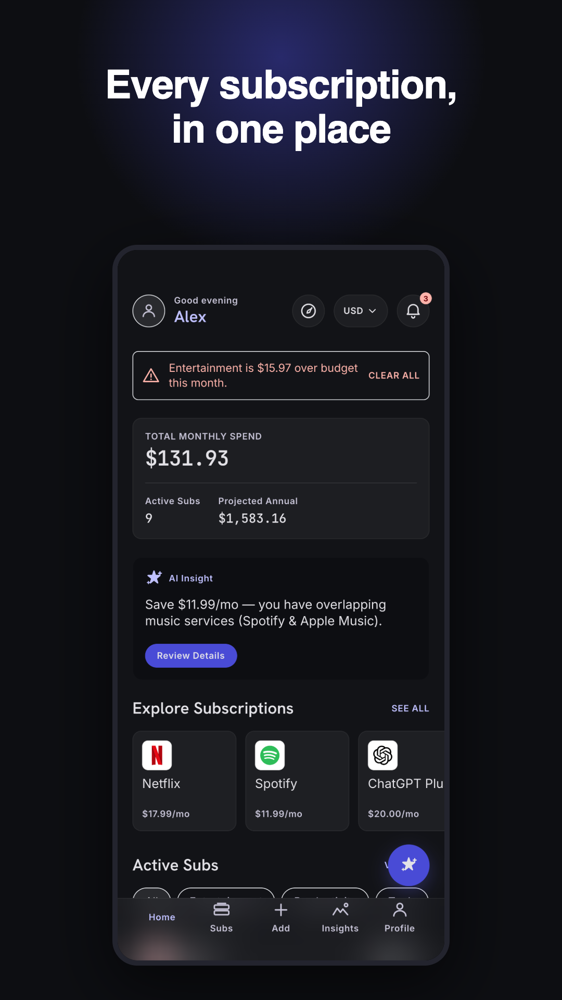
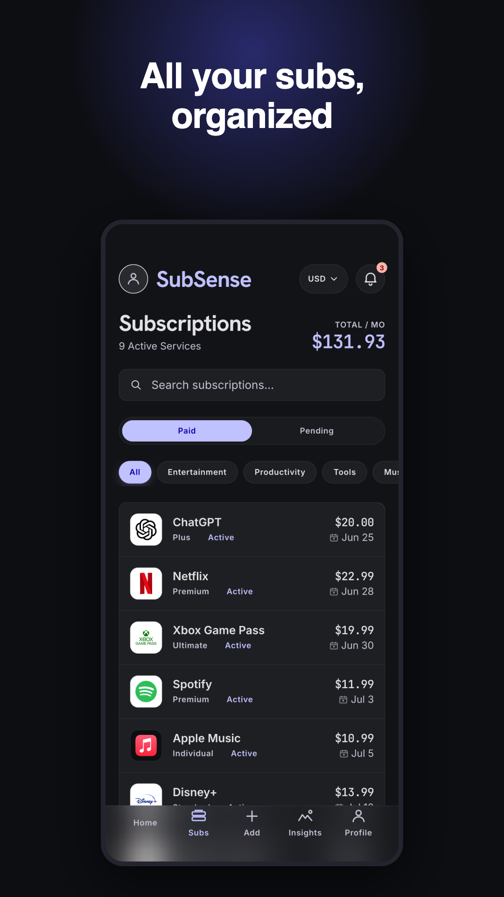
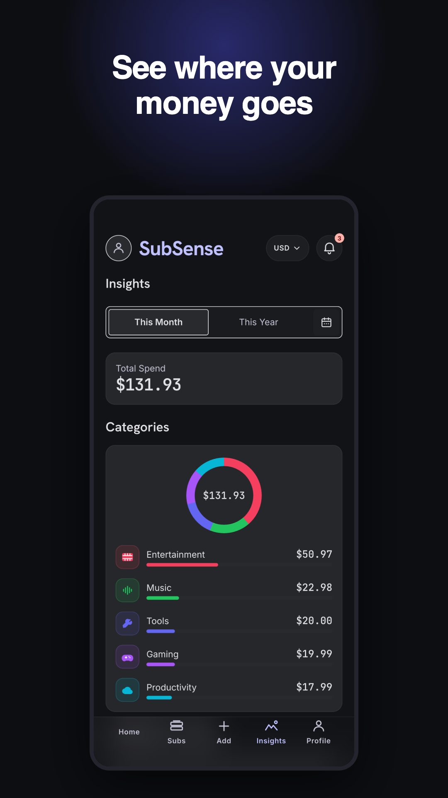
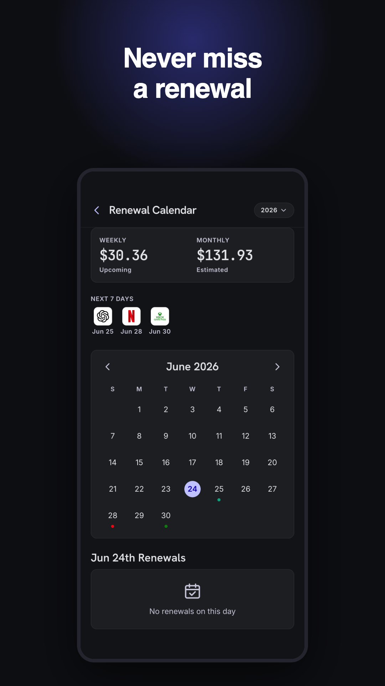
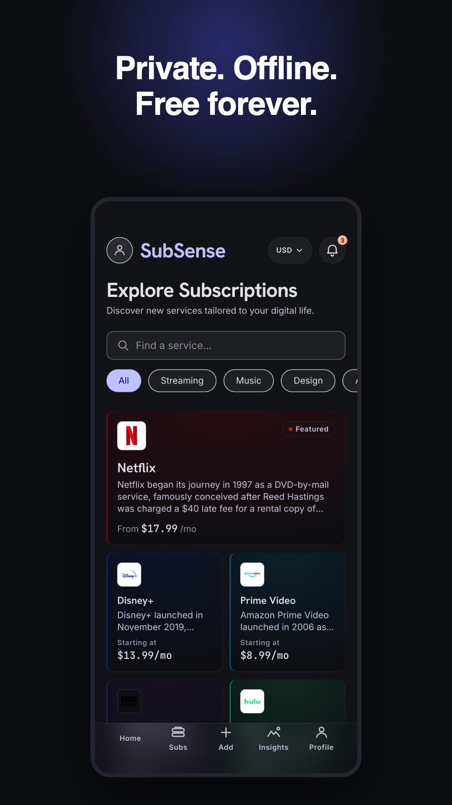

```text
███████╗██╗   ██╗██████╗ ███████╗███████╗███╗   ██╗███████╗███████╗
██╔════╝██║   ██║██╔══██╗██╔════╝██╔════╝████╗  ██║██╔════╝██╔════╝
███████╗██║   ██║██████╔╝███████╗█████╗  ██╔██╗ ██║███████╗█████╗  
╚════██║██║   ██║██╔══██╗╚════██║██╔══╝  ██║╚██╗██║╚════██║██╔══╝  
███████║╚██████╔╝██████╔╝███████║███████╗██║ ╚████║███████║███████╗
╚══════╝ ╚═════╝ ╚═════╝ ╚══════╝╚══════╝╚═╝  ╚═══╝╚══════╝╚══════╝
```

### **One dashboard. Every subscription.**
### Track renewals, control spending and cut waste — private by default, synced when you want it.

</div>

---

## ✦ What is SubSense?

**SubSense** is an iOS-style, **bilingual (TR / EN)** subscription tracker for people tired of forgotten free trials and silent price hikes. See your real monthly spend, never miss a renewal thanks to **local notifications**, browse a rich catalog of 40+ services, and keep everything **on your own device** — no account required.

Want your subscriptions on more than one phone? Sign in with Google to turn on **optional cloud sync** (Firebase). It stays **local-first**: cloud is strictly opt-in, and the app is fully usable — forever — without ever creating an account.

Built as a **React 19 + Vite + TypeScript** app, wrapped for **iOS and Android** with **Capacitor 6**, styled with **Tailwind CSS** and **Framer Motion**, in a dark-mode-first, fintech-grade design language.

<div align="center">

### 🎉 Available on Google Play — `com.subsense.apps`

</div>

> **Local-first by design.** Your subscriptions live in durable on-device storage (Capacitor Preferences). Cloud sync is optional and per-user isolated. No ads, no tracking, no analytics SDKs.

---

## 📱 Screenshots

<div align="center">







<sub>Live store screenshots from <a href="./play-assets"><code>/play-assets</code></a> — the exact assets shipped to Google Play.</sub>

</div>

---

## ⚡ Features

| Feature | Description |
|---------|-------------|
| 📊 **Live Dashboard** | Greeting header, total monthly spend, active count, projected annual, budget-over alerts |
| 🗂️ **Subscriptions** | List + swipe-to-edit/remove, search, Paid/Pending tabs, category filters, sort by date/price/name |
| ➕ **Rich Add/Edit** | Catalog picker → plan picker, or custom form (price, currency, cycle, status, next charge, payment, notes, reminder) with full validation |
| 🔎 **Explore (40+ services)** | Magazine-style bento grid → rich service profile (HQ, founders, CEO, valuation, users, regional pricing, milestones) |
| ☁️ **Optional Cloud Sync** | Sign in with Google to back up and sync subscriptions across devices via Firebase Firestore. Off by default, per-user isolated |
| 🔐 **Google Sign-In** | Native on Android (Play App Signing), web popup on desktop. Skippable — "continue without account" keeps everything local |
| 🗑️ **Account & Data Deletion** | In-app **Settings → Delete account** (removes cloud account + synced data) plus a public [deletion page](https://kutluhangil.github.io/SubSenseMobileApp/account-deletion.html) |
| 📅 **Renewal Calendar** | Month grid with brand dots, weekly/monthly summary, per-day renewal cards |
| 🔔 **Local Notifications** | On-device renewal reminders (no server / no APNs); scheduled on add/edit, reconciled on launch |
| 🤖 **On-device Assistant** | Rule-based spend suggestions (upcoming charges, overlapping services) — runs locally, no LLM, no data leaves the device |
| 📈 **Insights** | Real monthly/annual totals, category breakdown, data-driven overlap insight, CSV export |
| 💱 **Live FX + Currency** | Multi-currency with live exchange rates (24h cache) + bundled fallback; base currency re-prices everything |
| 🟢 **Live Price Catalog** | Optional self-hosted JSON keeps browse/Explore prices current without a store release ([details](#-live-price-catalog)) |
| 🌐 **TR / EN i18n** | Full bilingual UI incl. catalog editorial; device language auto-detected, switchable in Settings |
| 💾 **Local Backup** | Export / import your data as a file — you choose where it lives |
| 🎨 **Dark-first Theme** | Dark / Light / System appearance |
| 🧪 **Tested** | 85 Vitest unit tests over the money/date/insight logic + typecheck + build CI gate |

---

## 🛠️ Tech Stack

```
Framework       →  React 19 · Vite 6 · TypeScript 5
Native shell    →  Capacitor 6 (iOS + Android) · Preferences · Local Notifications · Status Bar · Splash
Styling         →  Tailwind CSS 3 · Framer Motion · Material Symbols
State           →  Zustand (persist → Capacitor Preferences)
Routing         →  React Router 7
i18n            →  Custom lightweight TR/EN layer (no dependency)
Cloud (opt-in)  →  Firebase Auth (Google) + Firestore (offline persistence, per-user rules)
Data            →  Bundled catalog + optional self-hosted live price JSON
FX rates        →  open.er-api.com (keyless, 24h cache, bundled fallback)
Assistant       →  On-device rule-based suggestions (no LLM / no backend)
Testing         →  Vitest (unit) · GitHub Actions CI (lint → test → build)
Docs hosting    →  GitHub Pages (privacy / help / account-deletion) via Actions
```

> **Cloud is optional and lazy-loaded.** The Firebase SDK (~700 KB) is code-split into its own async chunk and only loads when a user actually signs in — the local-first startup bundle is unchanged.

---

## ☁️ Optional Cloud Sync (Firebase)

SubSense ships **local-first**; cloud sync is additive and activates only when Firebase env is configured **and** the user signs in with Google.

| Aspect | Implementation |
|--------|----------------|
| **Auth** | Firebase Auth · Google provider — native plugin on Android, `signInWithPopup` on web |
| **Data** | Firestore `users/{uid}/subscriptions`, two-way sync with local-first reconcile (cloud wins on conflict) |
| **Isolation** | Security rules: `allow read, write: if request.auth.uid == uid` — no user can read another's data |
| **Offline** | Firestore `persistentLocalCache` — sync reconciles when back online |
| **Deletion** | `deleteAccount()` removes the profile + subscriptions + Firebase Auth user (with Google re-auth retry) |
| **Config** | Six `VITE_FIREBASE_*` vars in `.env.local` (see `.env.example`); absent → app is 100% local, cloud UI hidden |

No payment-card data is ever collected or stored. See the [privacy policy](https://kutluhangil.github.io/SubSenseMobileApp/privacy.html).

---

## 🚀 Getting Started

### Prerequisites

- **Node.js** `>= 18`
- **Xcode** + iOS simulator runtime (for iOS) · **Android Studio** + JDK 17 (for Android)
- macOS recommended

### Install & run

```bash
# Clone
git clone https://github.com/kutluhangil/SubSenseMobileApp.git
cd SubSenseMobileApp

# Install
npm install

# Web preview (fastest dev loop)
npm run dev            # http://localhost:5173

# Quality gates
npm run lint           # tsc --noEmit (type check)
npm test               # Vitest unit tests (85)
npm run build          # production web build → /dist

# iOS  (build + sync + open Xcode, then press ▶)
npm run ios

# Android release bundle (AAB)
npm run android:aab    # → android/app/build/outputs/bundle/release/app-release.aab
```

The app runs out of the box with bundled data and **no required env vars**. Two optional configs: the live price catalog URL, and the `VITE_FIREBASE_*` values to enable cloud sync.

---

## 🟢 Live Price Catalog

There is **no public API** for providers' official subscription prices, so SubSense ships a curated snapshot and supports an **optional, self-hosted live catalog** you control:

1. Edit [`public/price-catalog.example.json`](./public/price-catalog.example.json) (partial overrides merge over the bundled data).
2. Host it (GitHub raw / CDN / storage) and copy its URL.
3. Set `PRICE_CATALOG_URL` in [`src/data/catalog-source.ts`](./src/data/catalog-source.ts).

Fetched on launch (12h cache, bundled fallback) and re-rendered live — **no store update needed** when you change the JSON. Already-saved subscriptions keep the price the user entered.

---

## 🏗️ Architecture

```
┌───────────────────────────────────────────────────────────────┐
│                       SUBSENSE (on-device)                      │
│                                                                 │
│   ┌────────────┐   ┌────────────┐   ┌────────────────────────┐  │
│   │  Zustand   │   │  React 19  │   │  Framer Motion         │  │
│   │  + persist │   │  + Router  │   │  + Tailwind (dark)     │  │
│   └─────┬──────┘   └────────────┘   └────────────────────────┘  │
│         │ persist                                               │
│   ┌─────▼─────────────────┐  ┌───────────────────────────────┐  │
│   │ Capacitor Preferences  │  │ Local Notifications (renewals)│  │
│   │ (durable local storage)│  │ scheduled on-device, no APNs  │  │
│   └───────────────────────┘  └───────────────────────────────┘  │
└───────────────┬───────────────────────────────┬────────────────┘
                │ (optional, anonymous)          │ (optional, opt-in)
    ┌───────────┴──────────┐        ┌────────────┴───────────────────┐
┌────────────────────┐ ┌──────────────────┐   ┌────────────────────────────┐
│  open.er-api.com    │ │ Your price JSON  │   │ Firebase (Auth + Firestore) │
│  (FX, keyless)      │ │ (optional live)  │   │ Google sign-in · per-user   │
└────────────────────┘ └──────────────────┘   └────────────────────────────┘
```

State flows through Zustand with persistence to Capacitor Preferences. The app is fully usable offline; network is only used (best-effort) for FX rates, the optional price catalog, and — when a user opts in — Firebase cloud sync.

---

## 🔒 Security & Privacy

| Layer | Implementation |
|-------|----------------|
| **Data location** | All data stays on-device by default (Capacitor Preferences). A cloud copy exists only if the user signs in. |
| **Accounts** | Optional Google sign-in. No account required; "continue without account" keeps everything local. |
| **Cloud isolation** | Firestore rules enforce per-user access (`request.auth.uid == uid`). No payment-card data, ever. |
| **Secrets** | No secrets in the repo. `VITE_FIREBASE_*` are public config (security lives in the rules); `google-services.json` + `.env.local` are gitignored. |
| **Network** | HTTPS/TLS only. FX + price JSON are anonymous reads; Firebase transit is encrypted. |
| **Resilience** | Async calls wrapped in try/catch; a top-level `ErrorBoundary` prevents white-screen crashes. |
| **Data wipe** | Settings → **Clear Data** (local) and **Delete account** (cloud + auth user). Public [deletion instructions](https://kutluhangil.github.io/SubSenseMobileApp/account-deletion.html). |

---

## 🧪 Testing & Quality

- **85 unit tests (Vitest)** cover the pure logic that matters: currency conversion & formatting, month-end-safe date math, "stored price wins" pricing, totals/budget alerts, and the data-driven overlap insight.
- **CI (GitHub Actions):** every push runs `lint → test → build`.
- Run locally: `npm test` · `npm run lint` · `npm run build`.

```
Test Files  13 passed (13)
     Tests  85 passed (85)
```

---

## 📦 Release Status

| Item | Status |
|------|--------|
| Android package | `com.subsense.apps` · signed with Play App Signing |
| Google Play | Uploaded (closed test → production) · Data safety + account-deletion URL filed |
| Cloud sync | Configured (Firebase project live, Google sign-in verified on web) |
| Privacy / Help / Deletion pages | Hosted on GitHub Pages |
| iOS | Capacitor project ready; App Store submission is a future phase |

---

## 📄 License

No license file is included yet. Add a `LICENSE` (e.g. MIT) before publishing if you intend others to reuse the code.

---

<div align="center">

Built with React 19 · Capacitor 6 · Firebase (optional) · Local-first.

*If SubSense helps you tame your subscriptions, give the repo a ⭐*

</div>
